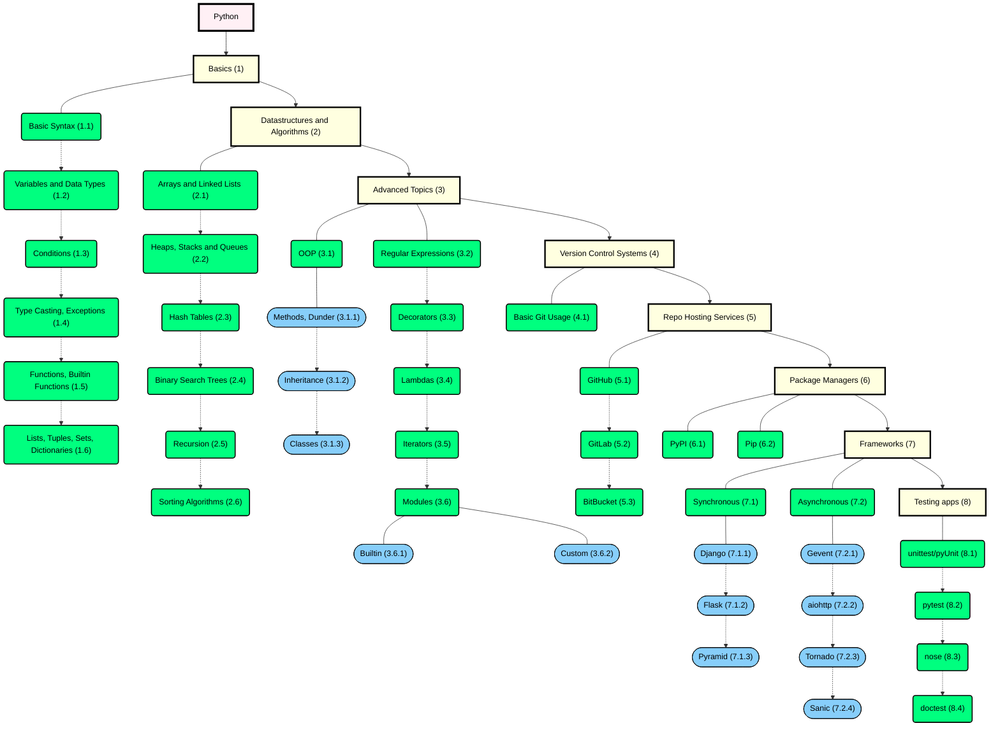

# Python roadmap / check list

 Here I'm marking items witch have been studied 

 Every node is clickable. You can watch my code examples depending on theme.

  

```mermaid
  flowchart TB
    node0["Python"]:::Title --> node1["Basics (1)"]
      click node0 "http://#"
 
  
      node1["Basics (1)"] --- node9("Basic Syntax (1.1)")
        
        node9("Basic Syntax (1.1)"):::SubClass1 -.-> node10("Variables and Data Types (1.2)")
          click node9 "http://#"
        node10("Variables and Data Types (1.2)"):::SubClass1 -.-> node11("Conditions (1.3)")
          click node10 "http://#"
        node11("Conditions (1.3)"):::SubClass1 -.-> node12("Type Casting, Exceptions (1.4)")
          click node11 "http://#"
        node12("Type Casting, Exceptions (1.4)"):::SubClass1 -.-> node13("Functions, Builtin Functions (1.5)")
          click node12 "http://#"
        node13("Functions, Builtin Functions (1.5)"):::SubClass1 -.-> node14("Lists, Tuples, Sets, Dictionaries (1.6)"):::SubClass1
          click node13 "http://#"
          click node14 "http://#"
 
    node1["Basics (1)"]:::ClassZero --> node2["Datastructures and Algorithms (2)"]
      click node1 "http://#"
  
      node2["Datastructures and Algorithms (2)"] --- node15("Arrays and Linked Lists (2.1)")
        
        node15("Arrays and Linked Lists (2.1)"):::SubClass1 -.-> node16("Heaps, Stacks and Queues (2.2)")
          click node15 "http://#"
        node16("Heaps, Stacks and Queues (2.2)"):::SubClass1 -.-> node17("Hash Tables (2.3)")
          click node16 "http://#"
        node17("Hash Tables (2.3)"):::SubClass1 -.-> node18("Binary Search Trees (2.4)")
          click node17 "http://#"
        node18("Binary Search Trees (2.4)"):::SubClass1 -.-> node19("Recursion (2.5)")
          click node18 "http://#"
        node19("Recursion (2.5)"):::SubClass1 -.-> node20("Sorting Algorithms (2.6)"):::SubClass1
          click node19 "http://#"
          click node20 "http://#"
 
    node2["Datastructures and Algorithms (2)"]:::ClassZero --> node3["Advanced Topics (3)"]
      click node2 "http://#"
  
      node3["Advanced Topics (3)"] --- node21("OOP (3.1)")
        
        node21("OOP (3.1)"):::SubClass1 --- node22(["Methods, Dunder (3.1.1)"])
          click node21 "http://#"
        node22(["Methods, Dunder (3.1.1)"]):::SubClass2 -.-> node23(["Inheritance (3.1.2)"])
          click node22 "http://#"
        node23(["Inheritance (3.1.2)"]):::SubClass2 -.-> node24(["Classes (3.1.3)"]):::SubClass2
          click node23 "http://#"
          click node24 "http://#"
 
      node3["Advanced Topics (3)"] --- node25("Regular Expressions (3.2)")
      
        node25("Regular Expressions (3.2)"):::SubClass1 -.-> node26("Decorators (3.3)")
          click node25 "http://#"
        node26("Decorators (3.3)"):::SubClass1 -.-> node27("Lambdas (3.4)")
          click node26 "http://#"
        node27("Lambdas (3.4)"):::SubClass1 -.-> node28("Iterators (3.5)")
          click node27 "http://#"
        node28("Iterators (3.5)"):::SubClass1 -.-> node29("Modules (3.6)")
          click node28 "http://#"
          click node29 "http://#"
 
          node29("Modules (3.6)"):::SubClass1 --- node30(["Builtin (3.6.1)"]):::SubClass2
            click node30 "http://#"
          node29("Modules (3.6)") --- node31(["Custom (3.6.2)"]):::SubClass2 
            click node31 "http://#"
 
    node3["Advanced Topics (3)"]:::ClassZero --> node4["Version Control Systems (4)"]
      click node3 "http://#"
  
      node4["Version Control Systems (4)"] --- node32("Basic Git Usage (4.1)"):::SubClass1
        click node32 "http://#"
 
    node4["Version Control Systems (4)"]:::ClassZero --> node5["Repo Hosting Services (5)"]
      click node4 "http://#"
 
      node5["Repo Hosting Services (5)"] --- node33("GitHub (5.1)")
        
        node33("GitHub (5.1)"):::SubClass1 -.-> node34("GitLab (5.2)")
          click node33 "http://#"
        node34("GitLab (5.2)"):::SubClass1 -.-> node35("BitBucket (5.3)"):::SubClass1
          click node34 "http://#"
          click node35 "http://#"
 
    node5["Repo Hosting Services (5)"]:::ClassZero --> node6["Package Managers (6)"]
      click node5 "http://#"
 
      node6["Package Managers (6)"] --- node36("PyPI (6.1)"):::SubClass1
        click node36 "http://#"
      node6["Package Managers (6)"] --- node37("Pip (6.2)"):::SubClass1
        click node37 "http://#"
        
    node6["Package Managers (6)"]:::ClassZero --> node7["Frameworks (7)"]
      click node6 "http://#"
      
        node7["Learn a Framework (7)"] --- node38("Synchronous (7.1)")
       
          node38("Synchronous (7.1)"):::SubClass1 --- node39(["Django (7.1.1)"])
            click node38 "http://#"
          node39(["Django (7.1.1)"]):::SubClass2 -.-> node40(["Flask (7.1.2)"])
            click node39 "http://#"
          node40(["Flask (7.1.2)"]):::SubClass2 -.-> node41(["Pyramid (7.1.3)"]):::SubClass2
            click node40 "http://#"
            click node41 "http://#"
        
        node7["Frameworks (7)"] --- node42("Asynchronous (7.2)")
       
          node42("Asynchronous (7.2)"):::SubClass1 --- node43(["Gevent (7.2.1)"])
            click node42 "http://#"
          node43(["Gevent (7.2.1)"]):::SubClass2 -.-> node44(["aiohttp (7.2.2)"])
            click node43 "http://#"
          node44(["aiohttp (7.2.2)"]):::SubClass2 -.-> node45(["Tornado (7.2.3)"]):::SubClass2
            click node44 "http://#"
          node45(["Tornado (7.2.3)"]):::SubClass2 -.-> node46(["Sanic (7.2.4)"]):::SubClass2      
            click node45 "http://#"
            click node46 "http://#"
      
    node7["Frameworks (7)"]:::ClassZero --> node8["Testing apps (8)"]:::ClassZero
      click node7 "http://#"
      click node8 "http://#"
      
      node8["Testing apps (8)"] --- node47("unittest/pyUnit (8.1)")
        click node47 "http://#"
      node47("unittest/pyUnit (8.1)"):::SubClass1 -.-> node48("pytest (8.2)")
        click node48 "http://#"
      node48("pytest (8.2)"):::SubClass1 -.-> node49("nose (8.3)")
        click node49 "http://#"
      node49("nose (8.3)"):::SubClass1 -.-> node50("doctest (8.4)"):::SubClass1
        click node50 "http://#"
    
    classDef Title fill:#FFF0F5, stroke:#000, stroke-width:4px, color:#000
    classDef ClassZero fill:#FFFFE0, stroke:#000, stroke-width:3px, color:#000
    classDef SubClass1 fill:#00FF7F, stroke:#000, stroke-width:2px, color:#000 
    classDef SubClass2 fill:#87CEFA, stroke:#000, stroke-width:1px, color:#000
```

Made with https://roadmap.sh/
